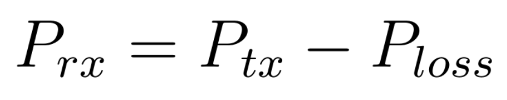
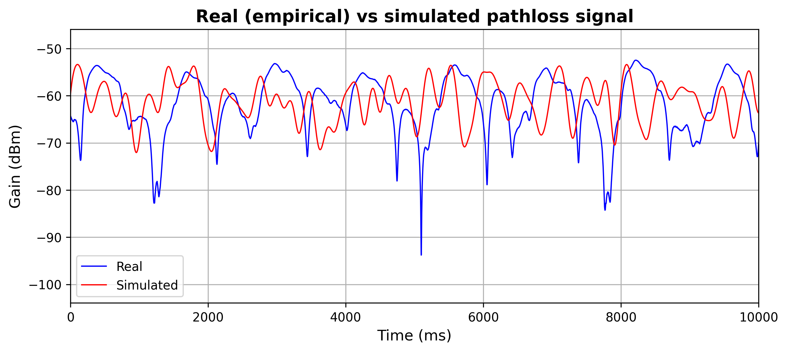

# ExTPC (Title Pending)

This repository contains the code for the thesis "Comparative Evaluation of Transmission Power Control Algorithms in WBAN: Energy Efficiency and Reliability Metrics" conducted at [University West](https://www.hv.se/en/).
The thesis is centered around the application of Transmission Power Control (TPC) in Wireless Body Area Networks (WBANs) as a way to save energy.

> Transmission Power Control (TPC) is a way to adaptively on the fly adjust the transmission power of the sender to save energy overall.
> The idea is to lower transmitt power when channel conditions are good and higher it when channel conditions are bad.
> In this way TPC can save power overall while still preserving reliability.

For the purposes of this simulation code the different TPC algorithms are akin to feedback loops.
The feedback process is based on an input signal of the pathloss for the channel over time. 
This is used to calculate the received power at the receiver which we want to preserve above -85dBm by adjusting the transmission power.


The pathloss signal is partly sourced from  the [“Body area network radio channel measurement set”](https://data.csiro.au/collection/csiro:18350v1) collected by [Commonwealth Scientific and Industrial Research Organization (CSIRO)]
(https://data.csiro.au/) and licensed under [CC BY-SA 4.0](https://creativecommons.org/licenses/by-sa/4.0/) which was used in the python simulation. 


# Repository structure

## Data
This folder simply containts the .mat files from the [“Body area network radio channel measurement set”](https://data.csiro.au/collection/csiro:18350v1) collected by [Commonwealth Scientific and Industrial Research Organization (CSIRO)]
(https://data.csiro.au/) and licensed under [CC BY-SA 4.0](https://creativecommons.org/licenses/by-sa/4.0/) which was used in the python simulation.
## Media
This folder includes figures generated from or related to the code. Some of the figures are present in this markdown document, others are not.
## Src
This folder contains the different python source code files. The files are organized as follows:

### main.py
This file containts the main loop of the code which goes over the pathloss signal and simulates the implementation of the TPC algorithms.
It starts by settings some global parameters and variables for the simulation.
It then instanciates each of the TPC algorithms and calculates the received and transmitted power for the first frame.
Each transmitted frame is then traversed and the TPC algorithms are given feedback and input so they can adaptively adjust their transmission power.

### tpc_methods.py
This file containts the actual implementations of the TPC algorithms.
The file starts by defining an abstract base class with abstract methods. This is Pythons version of an object oriented interface class.
Each TPC algorithm is then a subclass and implementation of this interface which allows for polymorphism in the main loop which simplifies the code.

### util_functions.py
This file containts some utility functions to make the simulation easier. The most important methods are:
load_mat_file
: Helps us list out the data fields in a .mat file and chose which one to load.
simulate_path_loss
: Simulates a pathloss signal based on a statistical model of the channel conditions taken from (Smith. et al, 2011)

# Running the code
To run the code simply follow these steps:

```bash
git clone https://github.com/DuckInTub/ExTPC # Clone the repository
cd ExTPC                                     # Navigate to it
pip install -r requirements.txt              # Install python libraries
cd src                                       # Go into the source directory
python3 main.py                              # Run the code with python
```